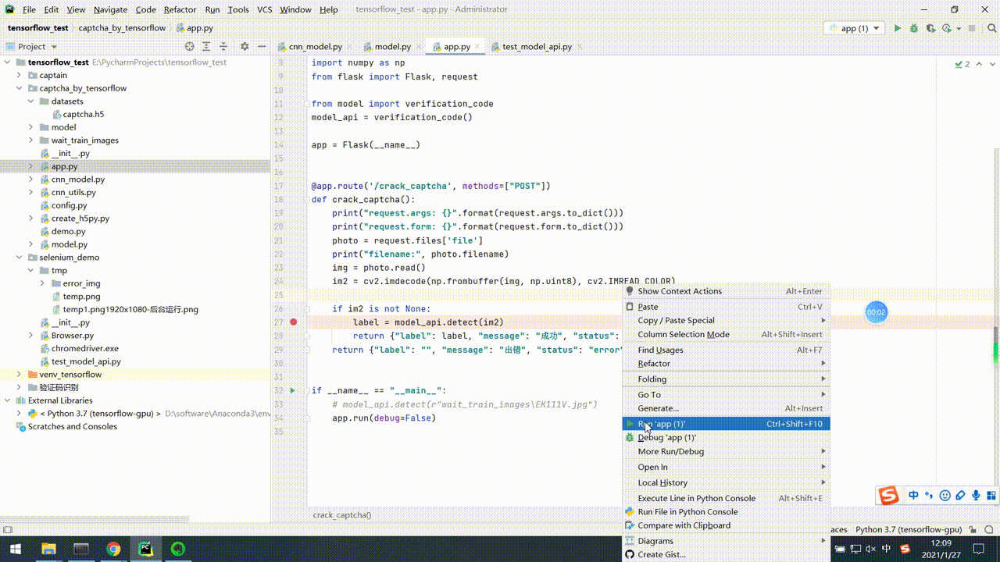
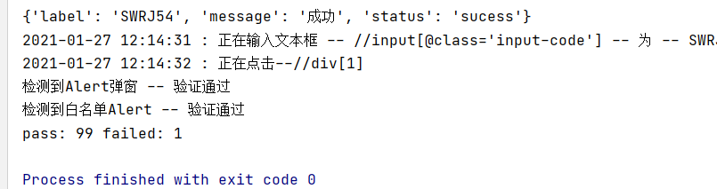
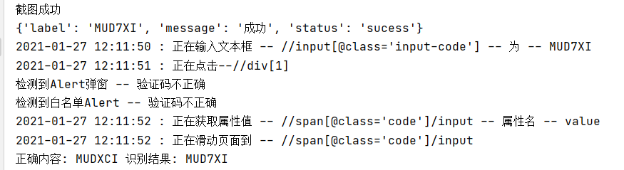

# captcha_by_tensorflow

## 背景

在之前做RPA自动化操作页面的业务流程中，经常会遇到一些图形验证码的困扰，导致整个自动化的流程需要人工进行输入验证码的步骤，无疑是增加了自动化流程的复杂程度，因此需要把输入图形验证码的步骤也让程序自动完成，就需要使用到AI模型进行验证码识别后返回给自动化程序输入，实现全流程的自动化操作（如果使用一些OCR识别的技术，效果非常差）。

### 前提

需要提前下载好验证码图片，并打标签(重命名文件名)

本示例目标网站

https://www.jq22.com/yanshi19634

已提供1万张下载好的验证码图片并压缩为 captcha_img.7z

## 环境

python版本: 3.7

系统: Window10.

## 先安装好依赖

`pip install -r requirements.txt`

## TensorFlow-GPU安装

requirements中的是GPU版的TensorFlow

步骤参考 

https://www.jianshu.com/p/ba3015941446/

https://blog.csdn.net/sinat_16489689/article/details/104095529

CPU版的TensorFlow安装比较简单，但是训练比较慢


## 使用

按需修改 captcha_by_tensorflow/config.py 里面的配置


### IMAGE_HEIGHT, IMAGE_WIDTH, IMAGE_C

图片的属性 高、宽、层(通道数)

验证码大小需要先处理统一一下属性

### str_charts

验证码里的所有字符(如这里的是 所有数字+所有大小字母组成 )

### CAPTCHA_LEN

验证码的长度(这里的是6位验证码)

### accuracy_rate

到多少准确度以后就停止训练

### checkpoint_path，model_pd_path

训练结束后保存模型的路径


## 开始训练

captcha_by_tensorflow/demo.py 中action参数设为0

`python captcha_by_tensorflow/demo.py`

## 预测验证码

captcha_by_tensorflow/demo.py 中action参数设为1

对应的本地验证码路径修改一下

`python captcha_by_tensorflow/demo.py`


## 部署成API

### 启动服务

`python captcha_by_tensorflow/app.py`

### 测试调用api

```
# 调用验证码识别api接口
files = {"file": open(tmp_img_path, "rb")}
result = requests.post("http://127.0.0.1:5000/crack_captcha", files=files)
res = result.json()
print(res)
```

## 演示页面自动化过程中调用
`python selenium_demo/test_model_api.py`



## 测试结果
100次识别，最终正确99次



## 识别失败的验证码





